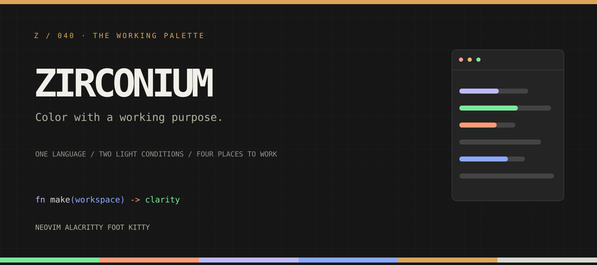

<div align="center">


# Zirconium

**Color with a working purpose.**

A dark and light color system for Neovim, Alacritty, foot and kitty. Designed for the whole terminal workspace—not just the editor screenshot.



[Explore the design](docs/DESIGN_PHILOSOPHY.md) · [Neovim configuration](THEME_README.md) · [Terminal installation](terminal/README.md) · [Development guide](DEVELOPMENT_GUIDE.md)

</div>

## The idea

The reference is the Zig documentation's light/dark syntax language as represented in the supplied xterm-256 preview: near-white structure, green strings and coral builtins on dark; ink structure, magenta strings and petrol builtins on light. Zirconium adapts that character to **legible everyday use** and fills the missing editor UI, diagnostics and ANSI slots with a consistent vocabulary. It is an independent theme, **not an official Zig project**. [See the exact source-to-theme mapping and contrast notes.](palette/README.md)

| | Dark / graphite | Light / paper |
| --- | --- | --- |
| Background | `#161616` | `#f9f8f4` |
| Text | `#d9d9d3` | `#303030` |
| String | `#7ce89a` | `#a8004e` |
| Builtin | `#ff9b79` | `#005f7d` |
| Function | `#bebaff` | `#890b12` |


## Quick start

**Neovim** (0.8+): add Zirconium to your lazy.nvim plugin list. The theme itself has no plugin dependencies.

```lua
{
  'T-450/zirconium',
  lazy = false,
  priority = 1000,
  config = function()
    vim.o.termguicolors = true
    vim.cmd.colorscheme('zirconium-dark') -- or zirconium-light
  end,
}
```

`vim.cmd.colorscheme('zirconium')` instead follows the current `vim.o.background`. See [the complete API, local runtimepath option and integrations](THEME_README.md).

**Terminals:** clone the repository once, then import your preferred variant directly from the checkout—no copied theme files to keep in sync:

```sh
git clone https://github.com/T-450/zirconium.git ~/.local/share/zirconium
```

[Exact Alacritty, foot and kitty imports →](terminal/README.md)

## A complete workspace

- Neovim core groups, modern Tree-sitter and LSP semantic groups, Zig syntax roles, diagnostics, search, diff, 16 terminal colors, optional transparent UI, overrides; cmp, bufferline and lualine integrations.
- Alacritty, foot and kitty foreground/background, cursor, selection and ANSI 0–15 in both appearances.
- A [static Svelte site](site/) with interactive theme previews and copyable starting points. Its [GitHub Pages project URL](https://t-450.github.io/zirconium/) is configured for deployment from `main` through `.github/workflows/pages.yml` once Pages is enabled. Build locally with `npm ci --prefix site && npm run build --prefix site && npm run test:prefix --prefix site`; deploy `site/dist/` to a static host. No application server is required.
- Reusable [SVG identity, banner, social card and palette poster](assets/). Fonts shipped with the site are self-hosted under the SIL Open Font License (see `site/public/fonts/`).

## Source of truth

`palette/zirconium.json` defines the tokens. Run `node scripts/generate.mjs` after changing it; generated Neovim, terminal and site palette files are committed. Run `node scripts/generate.mjs --check` and `node scripts/check-palette.mjs` to verify synchronization, reading contrast and site control-boundary contrast. Truecolor is recommended; Neovim also gets nearest xterm-256 `cterm` fallback. The reference xterm-256 palette **does not define ANSI 0–15**, which were designed for this theme.

## Development and license

Use the [development guide](DEVELOPMENT_GUIDE.md) for the demo config, build and safe headless tests. Licensed under [MIT](LICENSE). SVG assets follow the same license; self-hosted fonts retain their bundled OFL licenses.
