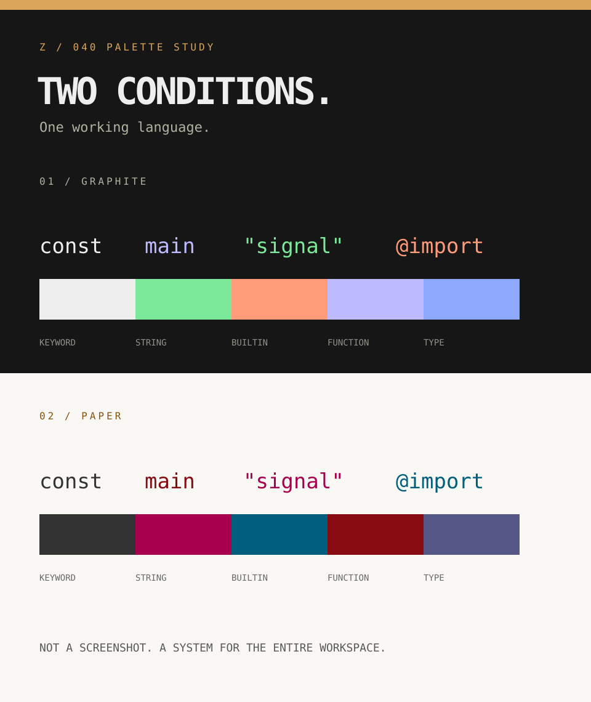

# Color with a working purpose

Zirconium is built for the Linux workstation where an editor, a terminal and a quick command are all part of one thought. The theme should make it easier to find a signal; it should not demand to be looked at for its own sake.

## The three principles

**01 / Keep the hierarchy honest.** Structure is bright or dark enough to read immediately, not so decorated that every token fights for the first glance. Functions and types carry shape; strings and builtins mark meaningful changes in intent. Comments remain readable across a long day. Weight can do work that hue alone shouldn't have to do.

**02 / Let every tool speak the same language.** A terminal warning, a diagnostic and a syntax error should feel related without being identical. Every application has its own palette format; they all derive their colors from shared roles. ANSI 0–15 is intentionally designed, not misrepresented as coming from a source mapping of xterm indices 16–255.

**03 / Build for changing light.** Dark graphite and warm paper are not a simple inversion. They share semantic names and distinct value choices, so switching between night focus and a bright desk preserves the reading hierarchy. Surfaces recede; active controls and deliberate signals come forward.

## The Zig Docs connection

The supplied Zig language-reference xterm-256 preview gave this project its starting vocabulary: graphite/near-white keywords, energetic green strings, coral builtins, lavender functions and blue types at night; paper/ink, magenta strings, petrol builtins and red functions by day. Its JSON notes that these were numerically nearest xterm approximations of source template values, not a verified copy of the live site. Zirconium does not claim affiliation, does not copy Zig branding and does not market itself as a faithful reproduction. See [the side-by-side palette mapping](../palette/README.md).

## Accessibility is part of the design

Text, syntax and diagnostic colors are checked against both the editor surface and the raised code surface; selection and cursor pairs are checked too. Our automated reading minimum is 4.96:1 on dark and 5.24:1 on light at the time of writing. The site's `ui.controlBorder` is checked at 3:1 or better on its page, panel and control surfaces. This is not a blanket accessibility certification: user transparency, color management, font choice, terminal ANSI rendering and third-party plugin highlights affect the final result. The site includes keyboard-accessible controls, visible focus, reduced-motion handling, a live status for copied values and selectable text when clipboard access is denied.

## Assets and usage

The SVG [monogram](../assets/zirconium-mark.svg), [banner](../assets/zirconium-hero.svg), [social card](../assets/zirconium-social.svg), and [palette poster](../assets/zirconium-palette.svg) form an editable, resolution-independent identity set. These are curated artwork—not generated outputs—and should be reviewed when the canonical palette changes. Project assets are MIT-licensed; site font files carry separate OFL licenses in `site/public/fonts/`.
